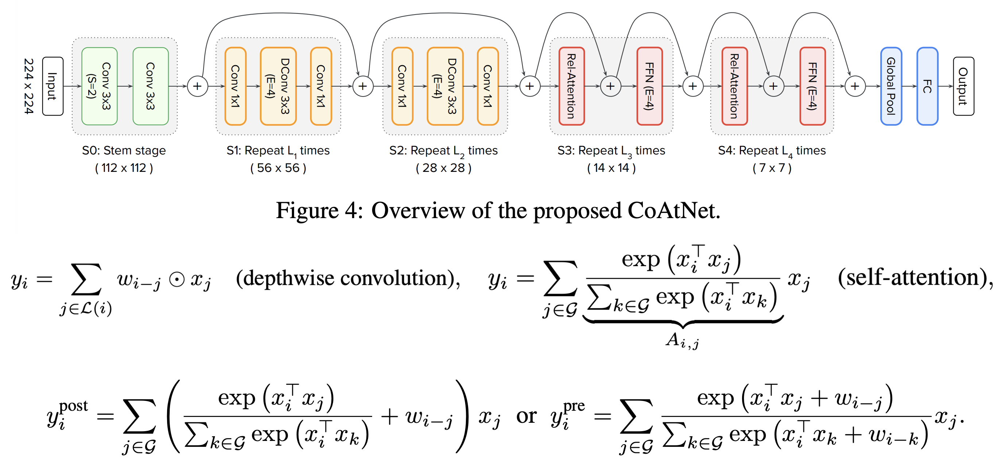

# Popular Backbones for Object Detection

## Content

* [AlexNet (2012)](#AlexNet)
* [VGG16 (2014)](#VGG16)
* [Inception (2014)](#Inception)
* [ResNet50 (2015)](#ResNet50)
* [DenseNet (2016)](#DenseNet)
* [MobileNet (2017)](#MobileNet)
* [ShuffleNet (2017)](#ShuffleNet)
* [NASNet (2018)](#NASNet)
* [CSPNet (2019)](#CSPNet)
* [SpineNet (2020)](#SpineNet)
* [EfficientNet (2020)](#EfficientNet)
* [Swin-Transformer (2021)](#SwinTransformer)
* [CoAtNet (2021)](#CoAtNet)

## [AlexNet](https://papers.nips.cc/paper/2012/file/c399862d3b9d6b76c8436e924a68c45b-Paper.pdf) (2012)<a name="AlexNet"/>

  

## [VGG16](https://arxiv.org/abs/1409.1556) (2014)<a name="VGG16"/>

  

## [Inception](https://arxiv.org/abs/1409.4842) (2014)<a name="Inception"/>

  

## [ResNet50](https://arxiv.org/abs/1512.03385) (2015)<a name="ResNet50"/>

  

## [DenseNet](https://arxiv.org/abs/1608.06993) (2016)<a name="DenseNet"/>

  

## [MobileNets V1](https://arxiv.org/abs/1704.04861) (2017) and [MobileNet V2](https://arxiv.org/abs/1801.04381) (2018) and [MobileNet V3](https://arxiv.org/abs/1905.02244) (2019)<a name="MobileNet"/>

  

  

## [ShuffleNet](https://arxiv.org/abs/1707.01083) (2017)<a name="ShuffleNet"/>

  

## [NASNet](https://arxiv.org/abs/1707.07012) (2018)<a name="NASNet"/>

  

## [CSPNet](https://arxiv.org/abs/1911.11929) (2019)<a name="CSPNet"/>

[Cross Stage Partial Network](https://arxiv.org/abs/1911.11929) is different from other backbones. It is a method for the enhancement from other backbones. The following picture shows an example.

  

## [SpineNet](https://arxiv.org/abs/1912.05027) (2020)<a name="SpineNet"/>

  

## [EfficientNet](https://arxiv.org/abs/1905.11946) (2020) and [EfficientNetV2](https://arxiv.org/abs/2104.00298) (2021)<a name="EfficientNet"/>

The advantage of [EfficientNet-B0](https://arxiv.org/abs/1905.11946) is that it simultaneously up-scale the channel size and down-sample the feature maps shape.

  

To scale up from [EfficientNet-B0](https://arxiv.org/abs/1905.11946) to [EfficientNet-B7](https://arxiv.org/abs/1905.11946), one has to follow the methods shown below

  

Compared to [EfficientNet](https://arxiv.org/abs/1905.11946), [EfficientNetV2](https://arxiv.org/abs/2104.00298) mixes MBConv and Fused-MBConv into the model, and uses progressive learning (different regularization with different input image sizes) to improve the training speed and parameters efficiency. Similar to [EfficientNet](https://arxiv.org/abs/1905.11946), the architecture of [EfficientNetV2](https://arxiv.org/abs/2104.00298) is also found by NAS (Neural Architecture Search).

  

## [Swin-Transformer](https://arxiv.org/abs/2103.14030) (2021)<a name="SwinTransformer"/>

[Swin-Transformer](https://arxiv.org/abs/2103.14030) is developed under the inspiration of [ViT](https://arxiv.org/abs/2010.11929). Specifically, it defines a window-based transformer mechanism for reducing the model size.

  

## [CoAtNet](https://arxiv.org/abs/2106.04803) (2021)<a name="CoAtNet"/>

The latest research of Google Brian Team shows the power of combining CNN models with Transformer. This paper is introduced with intensive and systematic experiments, including the work on improving the model generalization and capacity.

  

