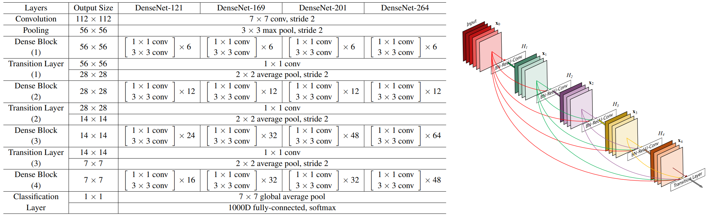

# Popular Backbones for Object Detection

## Contents

* [AlexNet](#AlexNet)
* [VGG16](#VGG16)
* [Inception](#Inception)
* [ResNet50](#ResNet50)
* [DenseNet](#DenseNet)
* [MobileNet](#MobileNet)
* [ShuffleNet](#ShuffleNet)
* [SpineNet](#SpineNet)

## [AlexNet](https://papers.nips.cc/paper/2012/file/c399862d3b9d6b76c8436e924a68c45b-Paper.pdf) (2012)<a name="AlexNet"/>

  

## [VGG16](https://arxiv.org/abs/1409.1556) (2014)<a name="VGG16"/>

  

## [Inception](https://arxiv.org/abs/1409.4842) (2014)<a name="Inception"/>

  

## [ResNet50](https://arxiv.org/abs/1512.03385) (2015)<a name="ResNet50"/>

  

## [DenseNet](https://arxiv.org/abs/1608.06993) (2016)<a name="DenseNet"/>

  

## [MobileNets V1](https://arxiv.org/abs/1409.4842) (2017) and [MobileNet V2](https://arxiv.org/abs/1801.04381) (2018)<a name="MobileNet"/>

  

## [ShuffleNet](https://arxiv.org/abs/1707.01083) (2017)<a name="ShuffleNet"/>

  

## [SpineNet](https://arxiv.org/abs/1912.05027) (2019)<a name="SpineNet"/>

  

