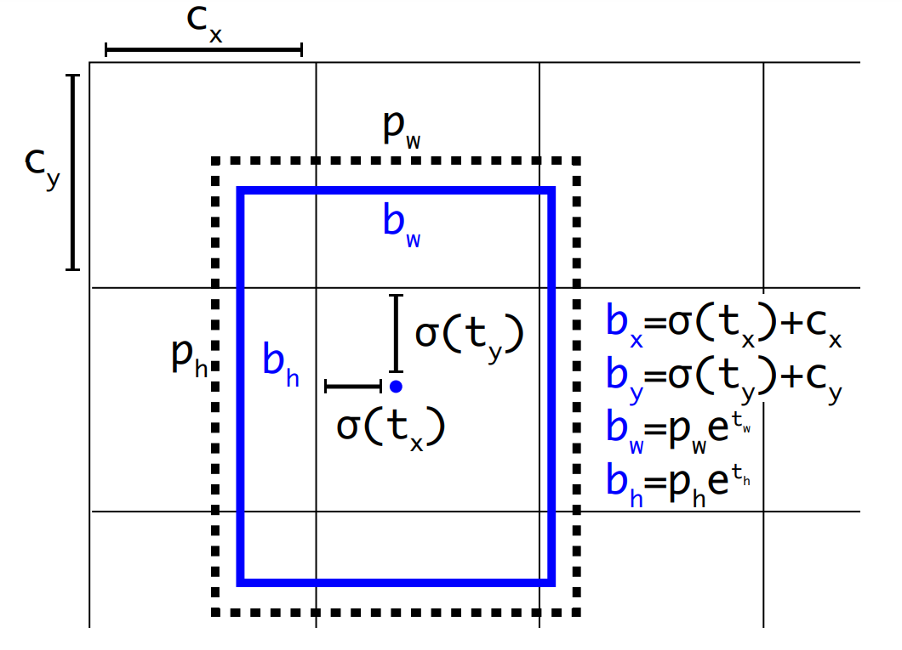
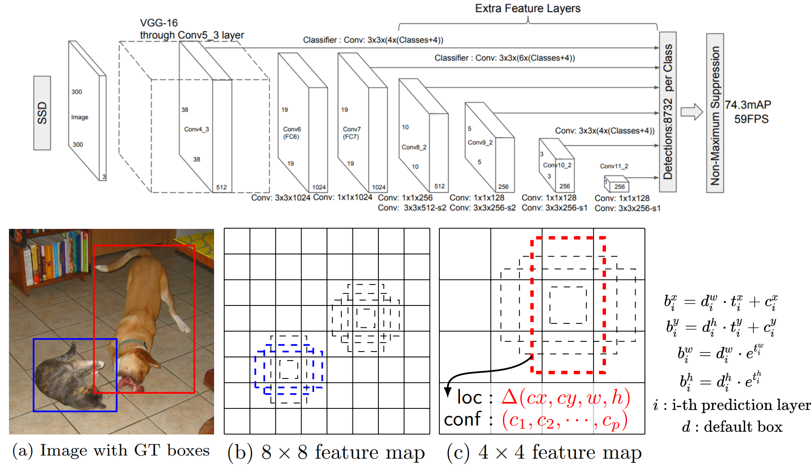
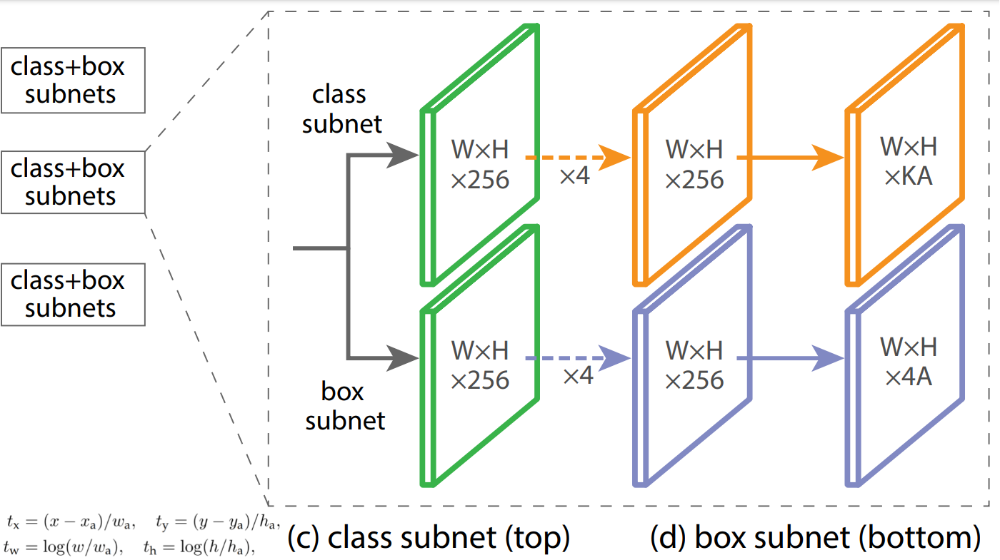
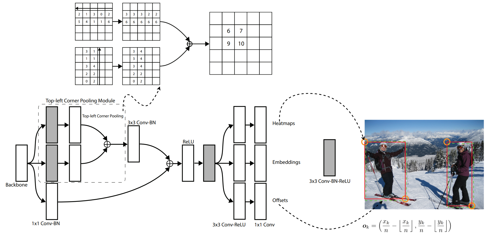
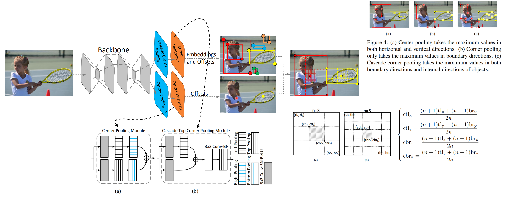
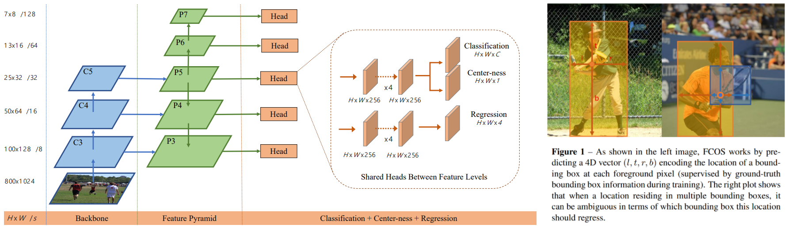
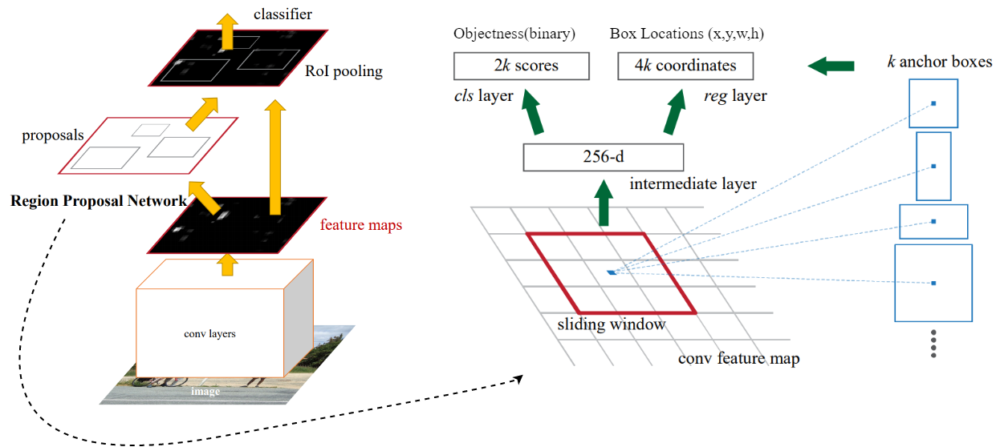

# Popular Detection Heads for Object Detection

## Content

* [One-Stage Anchor-Based Detectors](#OneAnchor)
    * [YOLO](#YOLO)
    * [SSD](#SSD)
    * [RetinaNet](#RetinaNet)
* [One-Stage Anchor-Free Detectors](#OneFree)
    * [CornerNet](#CornerNet)
    * [CenterNet](#CenterNet)
    * [FCOS](#FCOS)
* [Two-Stage Anchor-Based Detectors](#Two)
    * [Faster R-CNN](#FerRCNN)

## One-Stage Anchor-Based Detectors<a name="OneAnchor"/>

### [You Look Only Once (YOLO)](https://arxiv.org/pdf/1612.08242.pdf) (2016)<a name="YOLO"/>

- History of YOLO Detector: [YOLOv1](https://arxiv.org/abs/1506.02640), [YOLOv2](https://arxiv.org/abs/1612.08242), [YOLOv3](https://arxiv.org/abs/1804.02767), [YOLOv4](https://arxiv.org/abs/2004.10934), [YOLO web: DarkNet](https://pjreddie.com/darknet/).

- The box decoding system of [YOLO](https://arxiv.org/pdf/1612.08242.pdf) is shown as below.

<p align="center">
  
</p>

- Anchor boxes for [YOLO](https://arxiv.org/pdf/1612.08242.pdf) is defined by K-means Clustering on the entire dataset. All anchor boxes only consist of size info with format `[w, h]`. For [COCO](https://cocodataset.org/#home), [YOLOv2](https://arxiv.org/pdf/1612.08242.pdf) claims using `9` anchor boxes can achieve optimal performance.

- The original [YOLOv2](https://arxiv.org/pdf/1612.08242.pdf) performs the box decoding on a single-level feature maps. Therefore, the output shape before the box decoding system is
```yaml
raw features shape: [B, H, W, K, (5 + num_classes)]
B: batch size
H: height
W: width
K: number of anchor boxes
(5 + num_classes): box info [x, y, w, h] + objectness + num_classes
```

- Starting from [YOLOv3](https://arxiv.org/abs/1804.02767), with the combination of [FPN](https://arxiv.org/abs/1612.03144), multi-level feature maps are employed. Therefore, the output shape are orgnized in the following way. The detections of small objects are thus enriched.
```yaml
raw features shape: [B, 3, H, W, K/3, (5 + num_classes)]
B: batch size
H: height
W: width
3: 3 hierarchical levels from FPN
K: number of anchor boxes
(5 + num_classes): box info [x, y, w, h] + objectness + num_classes
```

### [Single Shot Detector (SSD)](https://arxiv.org/abs/1512.02325) (2016)<a name="SSD"/>

- [SSD](https://arxiv.org/abs/1512.02325) is a hierarchical-based detector from the beginning. The box decoding system of [SSD](https://arxiv.org/abs/1512.02325) is shown as below.

<p align="center">
  
</p>

- Since it is a hierarchical-based detector, the output shape before the box decoding is
```yaml
raw features shape: [B, m, H, W, K, (4 + num_classes)]
B: batch size
H: height
W: width
m: number of hierarchical levels
K: number of anchor boxes
(4 + num_classes): box info [x, y, w, h] + num_classes
```

- The anchor boxes of [SSD](https://arxiv.org/abs/1512.02325) is computed based on scale `s_k` and aspect ratios `a_r`. Aspect ratios are also defined by K-means Clustering on the entire dataset. The anchor boxes are defined as
```python
def getAnchor():
    a_r = [1, 2, 3, 1/2, 1/3] # all aspect ratios
    s_min = 0.2 # minimum scale
    s_max = 0.9 # maximum scale
    m = 5 # number of hierarchical levels
    for k in range(1, m):
        for a in a_r:
            s_k = s_min + (s_max - s_min) / (m - 1) * (k - 1) # scale of the k-th layer
            w_k_a = s_k * sqrt(a) # width of the anchor box w.r.t k-th layer a-th aspect ratio
            h_k_a = s_k / sqrt(a) # width of the anchor box w.r.t k-th layer a-th aspect ratio
```

- [SSD](https://arxiv.org/abs/1512.02325) also uses a special training skill, **Hard Negative Mining**. Hard negative mining is to select the negative samples with highest prediction probilities to conduct backpropagation. In SSD itself, the ratio of negative samples to positive samples is ensured as `3:1`.

### [RetinaNet](https://arxiv.org/abs/1708.02002) (2018)<a name="RetinaNet"/>

- This is the first-one to introduce neck layers to the One-Stage Object Detection.
<p align="center">
  
</p>

- The box decoding system is similar to [Faster R-CNN](https://arxiv.org/abs/1506.01497) and [SSD](https://arxiv.org/abs/1512.02325). Thus, the output shape before the box decoding is
```yaml
raw features shape: [B, m, H, W, K, (4 + num_classes)]
B: batch size
H: height
W: width
m: number of hierarchical levels
K: number of anchor boxes
(4 + num_classes): box info [x, y, w, h] + num_classes
```

- [RetinaNet](https://arxiv.org/abs/1708.02002) has `9` anchors per feature level. Specifically, the anchor boxes are derived from `3` aspect ratios `[1:2, 1:1, 2:1]` and `3` sizes `[2^0, 2^{1/3}, 2^{2/3}]`.

## One-Stage Anchor-Free Detectors<a name="OneFree"/>

### [CornerNet](https://arxiv.org/abs/1808.01244) (2019)<a name="CornerNet"/>

- [CornerNet](https://arxiv.org/abs/1808.01244) predicts the bounding boxes as top-left corners and bottom-right corners. Image below shows the detail of how it works. 
<p align="center">
  
</p>

- `Heatmaps` is for the corner finding; `Embeddings` is for the category interpretations; `Offsets` is to fine-tune the bounding box corners.

### [CenterNet](https://arxiv.org/abs/1904.08189) (2019<a name="CenterNet"/>

- [CenterNet](https://arxiv.org/abs/1904.08189) is developed under the inspiration of [CornerNet](https://arxiv.org/abs/1808.01244). Similar to CornerNet, a pair of detected corners and the similar embeddings are used to detect a potential bounding box. Then the detected center keypoints are used to determine the final bounding boxes.
<p align="center">
  
</p>

### [FCOS](https://arxiv.org/abs/1904.01355) (2019)<a name="FCOS"/>

- [FCOS](https://arxiv.org/abs/1904.01355) predicts the bounding box with the center and the offsets to the edges of the box.
<p align="center">
  
</p>

- For the center prediction, Specifically, location `[x, y]` is considered as a positive
sample if it falls into any ground-truth box and the class label `c` of the location is the class label of the ground-truth box. Otherwise it is a negative sample and `c = 0` (background class).

- If a location falls into multiple bounding boxes, it is considered as an ambiguous sample. We simply choose the bounding box with minimal area as its regression target.

## Two-Stage Anchor-Based Detectors<a name="Two"/>

### [Faster R-CNN](https://arxiv.org/abs/1506.01497) (2016)<a name="FerRCNN"/>

- It is the most original work, which inspired the all other One-Stage detectors, including [YOLO](https://arxiv.org/pdf/1612.08242.pdf) and [SSD](https://arxiv.org/abs/1512.02325). It introduces an "objectness" and "anchor boxes" in the **Region Proposal Networks**. The box decoding system is first developed here, and has been employed in other detectors such as [SSD](https://arxiv.org/abs/1512.02325) and [RetinaNet](https://arxiv.org/abs/1708.02002).
<p align="center">
  
</p>