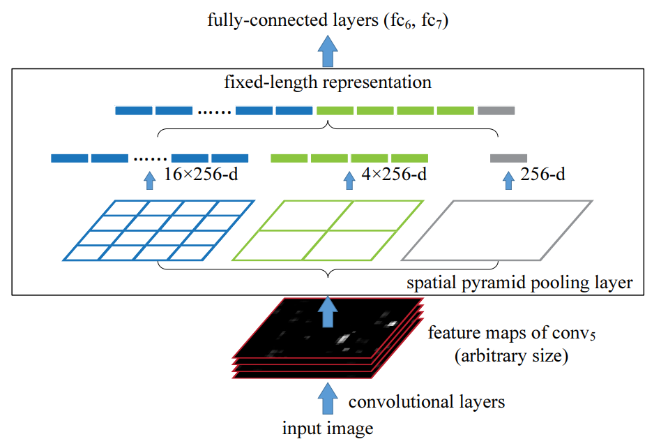

# Popular Neck Layers for Object Detection

## Content

* [Additional Blocks](#AddBlocks)
    * [SPP (2015)](#SPP)
    * [ASPP (2017)](#ASPP)
    * [RFB (2018)](#RFB)
    * [CBAM (2018)](#CBAM)
* [Path-aggregation Blocks](#PaBlocks)
    * [FPN (2017)](#FPN)
    * [PAN (2018)](#PAN)
    * [NAS-FPN (2019)](#NAS-FPN)
    * [ASFF (2019)](#ASFF)
    * [SFAM (2019)](#SFAM)
    * [BiFPN (2020)](#BiFPN)

## Additional Blocks<a name="AddBlocks"/>

### [SPP](https://arxiv.org/abs/1406.4729v4) (2015)<a name="SPP"/>

[Spatial Pyramid Pooling](https://arxiv.org/abs/1406.4729v4)

  

### [ASPP](https://arxiv.org/abs/1606.00915) (2017)<a name="ASPP"/>

[Atrous Spatial Pyramid Pooling](https://arxiv.org/abs/1606.00915) is proposed from [DeepLab V2](https://arxiv.org/abs/1606.00915).

  

### [RFB](https://arxiv.org/abs/1711.07767) (2018)<a name="RFB"/>

[Receptive Field Block](https://arxiv.org/abs/1711.07767)

  

### [CBAM](https://arxiv.org/abs/1807.06521) (2018)<a name="CBAM"/>

[Convolutional Block Attention Module](https://arxiv.org/abs/1807.06521)

  

## Path-aggregation Blocks<a name="PaBlocks"/>

### [FPN](https://arxiv.org/abs/1612.03144) (2017)<a name="FPN"/>

[Feature Pyramid Networks](https://arxiv.org/abs/1612.03144)

  

### [PAN](https://arxiv.org/abs/1803.01534) (2018)<a name="PAN"/>

[Path Aggregation Networks](https://arxiv.org/abs/1803.01534), the method used in "bottom-up path augmentation" block is `summation`.

  

### [NAS-FPN](https://arxiv.org/abs/1904.07392) (2019)<a name="NAS-FPN"/>

  

### [ASFF](https://arxiv.org/abs/1911.09516?utm_source=feedburner&utm_medium=feed&utm_campaign=Feed%253A+arxiv%252FQSXk+%2528ExcitingAds%2521+cs+updates+on+arXiv.org%2529) (2019)<a name="ASFF"/>

[Adaptively spatial feature fusion](https://arxiv.org/abs/1911.09516?utm_source=feedburner&utm_medium=feed&utm_campaign=Feed%253A+arxiv%252FQSXk+%2528ExcitingAds%2521+cs+updates+on+arXiv.org%2529)

  

### [SFAM](https://arxiv.org/abs/1811.04533) (2019)<a name="SFAM"/>

[Scale-wise Feature Aggregation Module](https://arxiv.org/abs/1811.04533)

  

### [BiFPN](https://arxiv.org/abs/1911.09070) (2020)<a name="BiFPN"/>

[Bi-directional feature pyramid network](https://arxiv.org/abs/1911.09070) is proposed from [EfficientNet](https://arxiv.org/abs/1911.09070).

  

