# Popular Choices of Operations for Object Detection

## Content

- [Activation Functions](#Activations)
    - [ReLU](#ReLU)
    - [Leaky ReLU](#LeakyReLU)
    - [Parametric ReLU](#ParametricReLU)
    - [ReLU6](#ReLU6)
    - [SELU](#SELU)
    - [GELU](#GELU)
    - [Swish](#Swish)
    - [Mish](#Mish)
- [Loss Functions for Box Regression](#LossFunctions)
    - [MSE](#MSE)
    - [IoU](#IoU)
    - [GIoU](#GIoU)
    - [DIoU](#DIoU)
    - [CIoU](#CIoU)
- [Loss Functions for Classification](#ClassLossFunctions)
    - [Cross Entropy](#CE)
    - [Focal](#Focal)
- [Data Augmentation](#DataAugmentation)
    - [Geometric](#Geometric)
    - [Color/Contrast](#ColorContrast)
    - [Crop/Pad](#Crop/Pad)
    - [Noise/Blur](#Noise/Blur)
    - [CutOut/MixUp/CutMix](#Cutout/MixUp/CutMix)
- [Regularization](#Regularization)
    - [DropOut](#Dropout)
    - [DropPath](#Droppath)
    - [DropBlock](#Dropblock)
- [Normalization](#Normalization)
    - [Batch Normalization](#BatchNorm)
    - [Layer Norm](#LayerNorm)

## Activation Functions<a name="Activations"/>

### ReLU<a name="ReLU"/>

```python
ReLU(x) = max(0, x)
```

### Leaky ReLU<a name="LeakyReLU"/>

```python
a = 0.1 # manually assigned
LeakyReLU(x) = max(0, x) + a * min(0, x)
```

### Parametric ReLU<a name="ParametricReLU"/>

```python
a = tf.Variable(0.1) # learnable
ParametricReLU(x) = max(0, x) + a * min(0, x)
```

### ReLU6<a name="ReLU6"/>

`6` is an arbitrary choice that worked well. According to the authors, the upper bound encouraged their model to learn sparse features earlier.
```python
ReLU6(x) = min(6, max(0, x)) + a * min(0, x)
```

### SELU<a name="SELU"/>

Scaled Exponential Linear Unit
```python
SELU(x) = b * ( max(0, x) + a * (exp(min(0, x)) - 1) )
```

### GELU<a name="GELU"/>

Gaussian Error Linear Unit
```python
GELU(x) = 0.5 * x * (1 + tanh(sqrt(2/pi)) * (x + 0.044715 * x**3))
```

### [Swish](https://arxiv.org/pdf/1710.05941v1.pdf?source=post_page) (2017)<a name="Swish"/>

```python
Swish(x) = x * sigmoid(a * x) = x / (1 + exp(- a * x))
```

### [Mish](https://arxiv.org/abs/1908.08681) (2020)<a name="Mish"/>

```python
Mish(x) = x * tanh(softplus(x))
```

## Loss Functions<a name="LossFunctions"/>

### MSE<a name="MSE"/>

```python
MSE(gt, pred) = mean(square(gt - pred))
```

### [IoU](https://arxiv.org/abs/1908.03851) (2019)<a name="IoU"/>

<p align="center">
  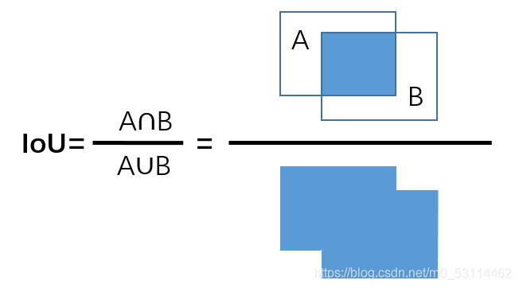
</p>

### [GIoU](https://arxiv.org/abs/1902.09630) (2019)<a name="GIoU"/>

Generalized IoU
<p align="center">
  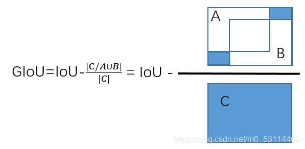
</p>

### [DIoU](https://arxiv.org/abs/1911.08287) (2019)<a name="DIoU"/>

Distance IoU
<p align="center">
  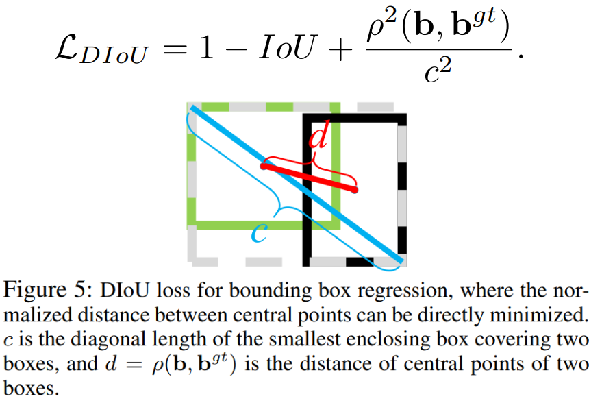
</p>

### [CIoU](https://arxiv.org/abs/1911.08287) (2019)<a name="CIoU"/>

Complete IoU
<p align="center">
  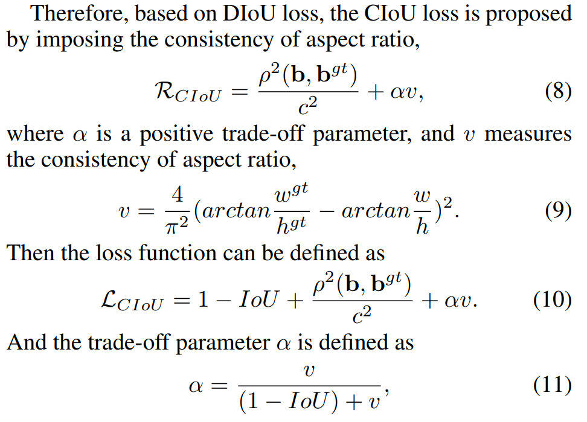
</p>

## Loss Functions for Classification<a name="ClassLossFunctions"/>

### Cross Entropy<a name="CE"/>

```python
CE(gt, pred) = - gt * log(pred) - (1 - gt) * log(1 - pred)
```

### [Focal](https://arxiv.org/abs/1708.02002) (2018)<a name="Focal"/>

<p align="center">
  
</p>

## Data Augmentation<a name="DataAugmentation"/>

### [Geometric](https://github.com/aleju/imgaug#example_images)<a name="Geometric"/>

Including Rotation, Flip, Affine, Perspective Transformation

Rotation                  |  Flip                     |  Affine                | Perspective Transformation
:------------------------:|:-------------------------:|:----------------------:|:----------------------:|
  |  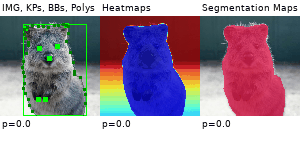     |  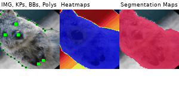|  

### [Color/Contrast](https://github.com/aleju/imgaug#example_images)<a name="ColorContrast"/>

Including Brightness, Saturation, Hue, Gamma, Color Invert

Brightness                | Saturation                |  Hue                   | Gamma                  | Color Invert
:------------------------:|:-------------------------:|:----------------------:|:----------------------:|:-----------------:
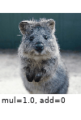  |  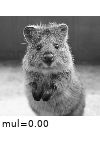     |  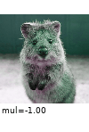|  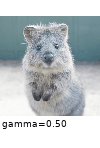 | 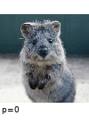

### [Crop/Pad](https://github.com/aleju/imgaug#example_images)<a name="Crop/Pad"/>

Including Crop and Pad

Crop                | Pad                
:------------------------:|:-------------------------:
  |  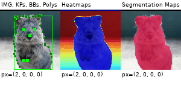

### [Noise/Blur](https://github.com/aleju/imgaug#example_images)<a name="Noise/Blur"/>

Including Salt and Pepper Noise, Gaussian Blur

Salt and Pepper           | Gaussian Blur                
:------------------------:|:-------------------------:
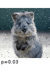  |  

### [CutOut/MixUp/CutMix](https://github.com/aleju/imgaug#example_images)<a name="Cutout/MixUp/CutMix"/>

Including 3 papers, [CutOut](https://arxiv.org/abs/1708.04552), [MixUp](https://arxiv.org/abs/1710.09412) and [CutMix](https://arxiv.org/abs/1905.04899)

<p align="center">
  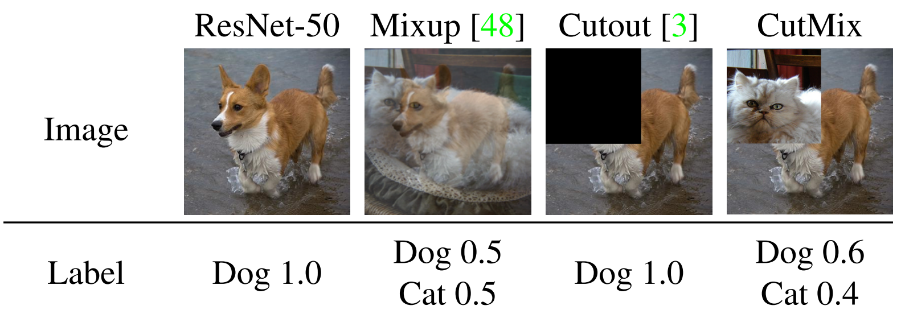
</p>

**Note:** For the implementation of MixUp in Object Detection, the loss function of box regression is computed based on all the instances in both images. On the other hand, the loss function of classification is a combination of loss functions from individual images. For example, if the mixup coefficient is `a = 0.4`, the loss function of classification would be `L_mixup = a * L_image1 + (1-a) * L_image2`

<p align="center">
  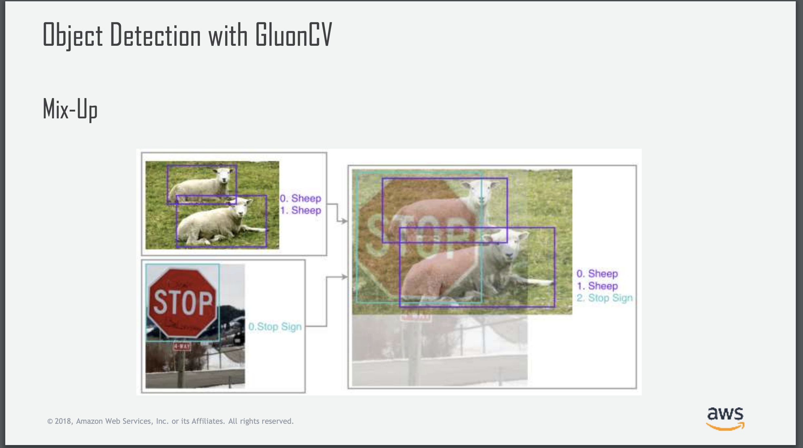
</p>

## Regularization<a name="Reuglarization"/>

### [DropOut](https://arxiv.org/abs/1207.0580) (2012)<a name="Dropout"/>

Implementations can be found at [TensorFlow](https://www.tensorflow.org/api_docs/python/tf/keras/layers/Dropout) and [PyTorch](https://pytorch.org/docs/stable/generated/torch.nn.Dropout.html).

### [DropPath](https://arxiv.org/abs/1605.07648v4) (2017)<a name="Droppath"/>

<p align="center">
  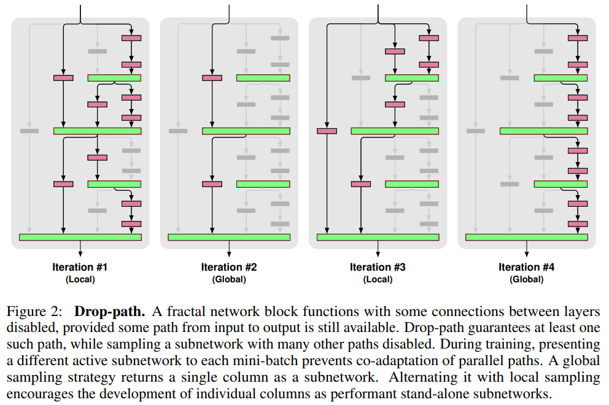
</p>

### [DropBlock](https://arxiv.org/abs/1810.12890) (2018)<a name="Dropblock"/>

<p align="center">
  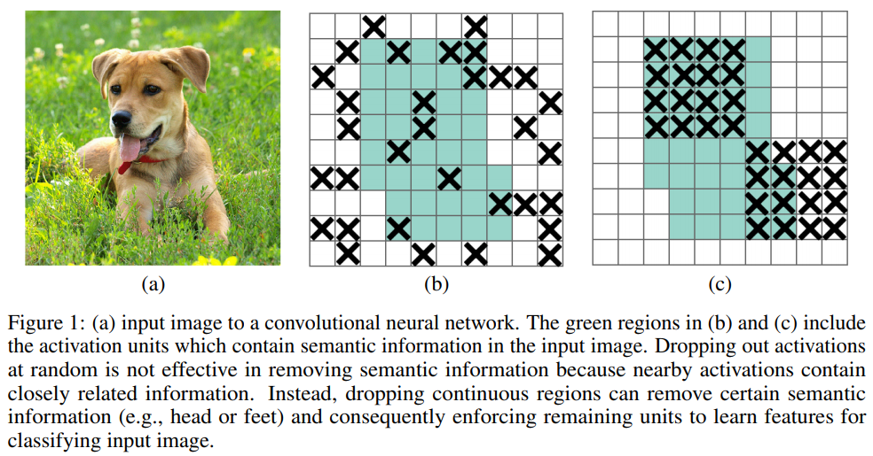
</p>

## Normalization<a name="Normalization"/>

### [Batch Normalization](https://arxiv.org/abs/1502.03167) (2015)<a name="BatchNorm"/>

**NOTE**: Normalization is conducted through *batch size*.

<p align="center">
  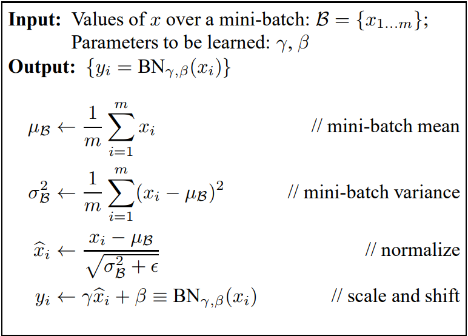
</p>

### [Layer Norm](https://arxiv.org/abs/1607.06450) (2016)<a name="LayerNorm"/>

**NOTE**: Normalization is conducted through *feature channels*.

<p align="center">
  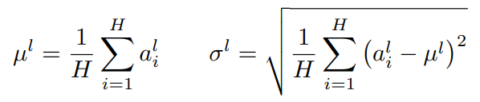
</p>