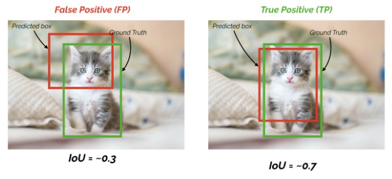
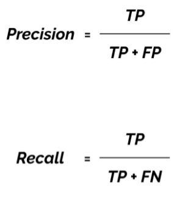
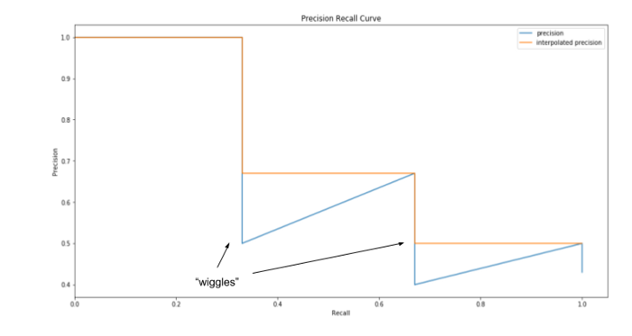
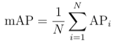

# Mean Average Precision (mAP) for Object Detection

A detailed implementation can be found at [GitHub/mAP](https://github.com/Cartucho/mAP). Following sections illustrate how to compute mAP.

Before diving in, we first define a parameter `iou_threshold` such that the `mAP` function can take it as arg.
```python
iou_threshold = 0.3/0.5/0.7 # 3 popular thresholds used for metrics
mAP(iou_threshold)
```

## Compute True Positive (TP)

- First , we need to **sort** all the prediction boxes according to their **scores**.

- To define TP, simply we can use the following method. As a result, we can get a list `TP` with `len(TP) == len(pred_boxes)`
```python
if (IoU(pred_box, gt_box) >= iou_threshold):
    TP.append(1)
else
    TP.append(0)
```

- Assume we have `iou_threshold = 0.5`, we can easily define if the box belongs to TP or not, as shown in the image below.
<p align="center">
  
</p>

## Compute Precision and Recall

- Use the following equations to compute *precision* and *recall*. We will get the results as lists as well.
<p align="center">
  
</p>

## Plot Precision-Recall Curve

- The following image shows an example of how *precision-recall* curve looks like.
<p align="center">
  
</p>

- The "wiggles" in the curve will be flattened according the biggest/last value of the corresponding stage.

## Compute mAP

- Use the equation below to compute *mAP*. Specifically, calculate the area under the *precision-recall* curve shown above.
<p align="center">
  
</p>