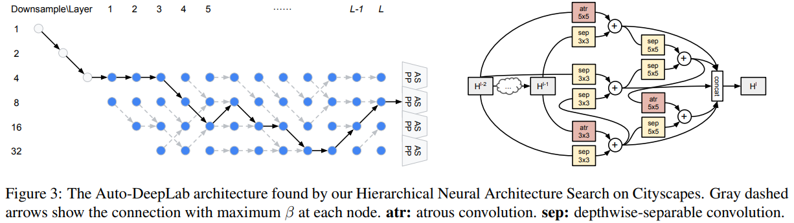
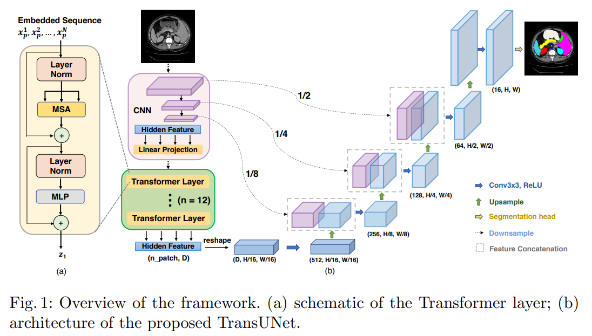

# Popular Architectures for Semantic Segmentation

## Content 

- [FCN (2015)](#FCN)
- [SegNet (2016)](#SegNet)
- [DeepLab](#DeepLab)
  - [DeepLab V1 (2016)](#DeepLabV1)
  - [DeepLab V2 (2017)](#DeepLabV2)
  - [DeepLab V3 (2017)](#DeepLabV3)
  - [Auto-DeepLab (2019)](#AutoDeepLab)
- [U-Net](#U-Net)
  - [U-Net (2015)](#UNet)
  - [Attention U-Net (2018)](#AttentionUNet)
  - [TransUNet (2021)](#TransUNet)
- [Swin-Transformer](#SwinTransformer)

## [Fully Convolutional Networks (FCN)](https://arxiv.org/abs/1411.4038) (2015)<a name="FCN"/>

  

## [SegNet](https://arxiv.org/abs/1511.00561) (2016)<a name="SegNet"/>

The Upsampling layers in [SegNet](https://arxiv.org/abs/1511.00561) is performed based on the indexes from MaxPooling layers.

  

## DeepLab<a name="DeepLab"/>

### [DeepLab V1](https://arxiv.org/abs/1412.7062) (2016)<a name="DeepLabV1"/>

[DeepLab V1](https://arxiv.org/abs/1412.7062) is the first to introduce *Atrous Convolution* (shown as the left of the figure below), which is later viewed as the most outstanding property of the DeepLab series.

  

For the explanation of fully-connected CRF, the following equations shows the original explanation from the paper. As can be seen, the calculation of CRF model is based on its Energy function. The connection between two different pixel locations is based on Gaussian Kernel.

  

### [DeepLab V2](https://arxiv.org/abs/1606.00915) (2017)<a name="DeepLabV2"/>

Compared to [DeepLab V1](https://arxiv.org/abs/1412.7062), [DeepLab V2](https://arxiv.org/abs/1606.00915) introduces another practical method, called Atrous Spatial Pyramid Pooling (ASPP). The block is added to the end of the backbone and thus the performance of [DeepLab V2](https://arxiv.org/abs/1606.00915) exceeds [DeepLab V1](https://arxiv.org/abs/1412.7062). All other implementations including fully-connected CRF are kept the same.

  

### [DeepLab V3](https://arxiv.org/abs/1706.05587) (2017)<a name="DeepLabV3"/>

Starting from [DeepLab V3](https://arxiv.org/abs/1706.05587), the fully-connected CRF is removed. Instead, Atrous Convolutional layers are fully explored. Different stride rates are applied in the entire model which the backbone itself can keep a certain large feature maps resolution.

  

### [Auto-DeepLab](https://arxiv.org/abs/1901.02985) (2019)<a name="AutoDeepLab"/>

Using Neural Architecture Search (NAS), the model is designed by Deep Learning itself and thus outperforms previous DeepLab versions.

  

## U-Net<a name="U-Net"/>

### [U-Net](https://arxiv.org/abs/1505.04597) (2015)<a name="UNet"/>

The modern variations of [U-Net](https://arxiv.org/abs/1505.04597) usually adapt the upsampling layers to the preferences, e.g. Bilinear Interpolation, Nearest Interpolation, or Deconvolution.

  

### [Attention U-Net](https://arxiv.org/abs/1804.03999) (2018)<a name="AttentionUNet"/>

In [Attention U-Net](https://arxiv.org/abs/1804.03999), the Attention Blocks, shown as blow, are applied to the skip-connection stages. The `g`, which means *gating*, is the previously un-downsampled stage. The `x`, which is the downsampled stage, is upsampled before fed into the Attention Blocks.

  

### [TransUNet](https://arxiv.org/abs/2102.04306) (2021)<a name="TransUNet"/>

Inspired by [ViT](https://arxiv.org/abs/2010.11929), [TransUNet](https://arxiv.org/abs/2102.04306) added a *Vision Transformer Block* to the lowest-level feature maps to [U-Net](https://arxiv.org/abs/1505.04597), and thus achieved higher performance.

  

## [Swin-Transformer](https://arxiv.org/abs/2103.14030) (2021)<a name="SwinTransformer"/>

[Swin-Transformer](https://arxiv.org/abs/2103.14030) is developed under the inspiration of [ViT](https://arxiv.org/abs/2010.11929). Specifically, it defines a window-based transformer mechanism for reducing the model size.

  

