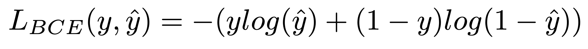
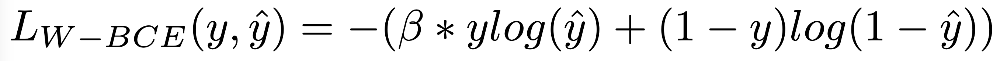
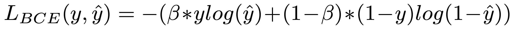
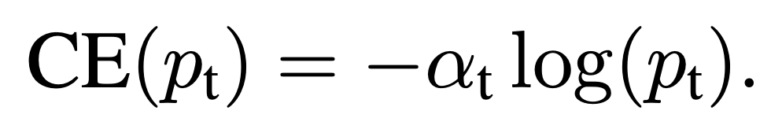
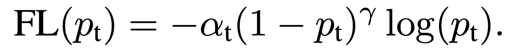
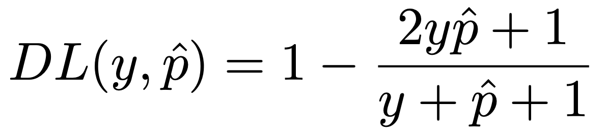
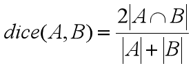
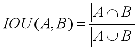

# Popular Loss Functions for Semantic Segmentation

There is an article that summarizes the most popular loss functions for semantic segmentation. The article is available [here](https://arxiv.org/abs/2006.14822).

## Content

* [Cross Entropy](#CE)
* [Focal Loss](#FL)
* [Dice Loss](#Dice)

## Cross Entropy<a name="CE"/>

Cross Entropy is the most typical loss function used for classification. Here, we use binary cross entropy as an example for illustrating this echnique mathmatically.

  

Sometimes, the unbalanced dataset may affect the performance of cross entropy. Therefore, an improved version, weighted cross entropy, has been employed by many researchers.

  

To further improve the generalization of weighted cross entropy, a new form, called balanced cross entropy, is proposed as follow.

  

  

The formal mathmatical definition of Focal Loss is as follow:

  

The generalized form of Dice Loss is:

  

  

  
</p