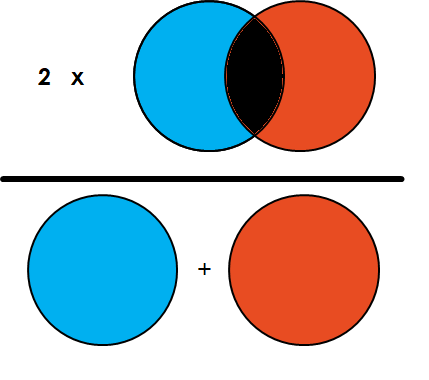

# Popular metrics used in semantic segmentation

## Content

* [Mask IoU](#miou)
* [F1 score](#f1score)

## Mask IoU<a name="miou"/>

Since semantic segmentation is not an instance-wise detection algorithm, the AP metric is not applicable. Instead, we use the Mask Iou metric to evaluate the performance of semantic segmentation.

  

## F1 score<a name="f1score"/>

Another popular method to evaluate the performance of semantic segmentation is the F1 score. The F1 score is the harmonic mean of precision and recall.

  

